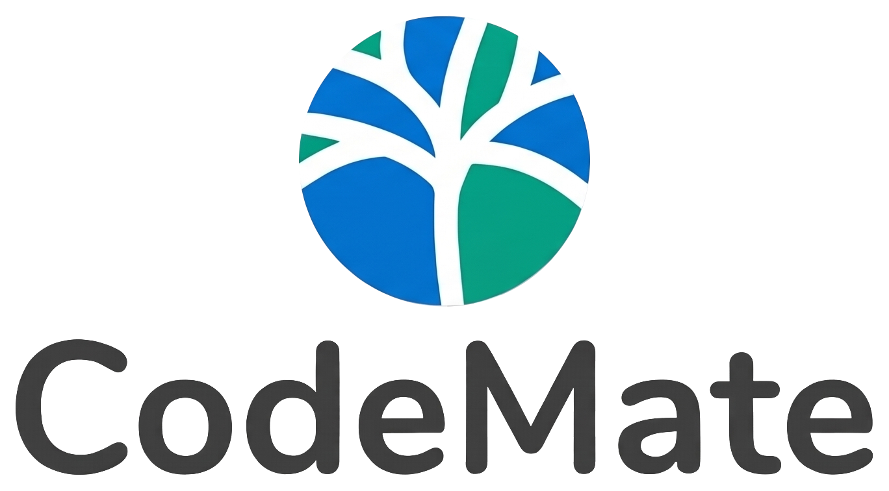

<div align="center">
  <picture>
    <source media="(prefers-color-scheme: dark)" srcset="codemate-frontend/src/assets/brand-logo.png">
    
  </picture>

  <p><strong>找到合适的编程伙伴，组建队伍，即时交流。</strong></p>
  <p>Vue 3 · Spring Boot · Netty · LangChain4j</p>

  <p>
    <a href="#产品能力">产品能力</a> ·
    <a href="#技术架构">技术架构</a> ·
    <a href="#本地启动">本地启动</a> ·
    <a href="#项目结构">项目结构</a>
  </p>
</div>

## 项目简介

CodeMate 是面向编程学习者和开发者的协作平台。用户可以根据技术标签发现伙伴，创建或加入队伍，通过私聊、队伍聊天室沟通，并使用 AI 编程助手获取学习与开发建议。项目采用 Vue 前端与 Spring Boot 后端分离的结构。

## 产品能力

| 模块 | 主要功能 |
| --- | --- |
| 用户与画像 | 注册登录、个人资料、技术标签与头像管理 |
| 伙伴发现 | 用户搜索、标签筛选与匹配推荐 |
| 队伍协作 | 创建、搜索、加入、退出和管理队伍；支持公开、私有及加密队伍 |
| 即时沟通 | 私聊与队伍聊天，支持查看历史消息 |
| AI 编程助手 | 基于 LangChain4j 的对话与知识检索增强，使用 SSE 返回流式回复 |

## 技术架构

```text
Vue 3 + TypeScript + Vant
  ├─ HTTP / SSE ──> Spring Boot (:8080, /api)
  │                 ├─ MySQL / Redis / RabbitMQ / Elasticsearch
  │                 └─ LangChain4j ──> 大模型 API / Ollama 向量模型
  └─ WebSocket ──> Netty (:8091, /ws/chat)
```

前端使用 Vite、Vue Router 和 Tailwind CSS；后端使用 Spring Boot、MyBatis-Plus、Redis、RabbitMQ、Elasticsearch 与 Netty。AI 模块通过 LangChain4j 接入聊天模型和本地向量模型。上述服务的连接信息以实际配置为准。

## 本地启动

以下命令以 Windows PowerShell、仓库根目录为起点。请先准备 JDK 21、Node.js/npm、MySQL、Redis 和 RabbitMQ。使用标签检索与 AI 功能时，还需要按配置准备 Elasticsearch（含 IK 分词）、大模型 API Key 和 Ollama 向量模型。

1. 在 MySQL 客户端执行 [`create_table.sql`](codemate-backend/src/main/resources/sql/create_table.sql)。脚本会创建并选中 `codemate` 数据库。
2. 如果本地尚无 `codemate-backend/src/main/resources/application.yml`，从 [`application-template.yml`](codemate-backend/src/main/resources/application-template.yml) 复制一份；填写数据库、Redis、RabbitMQ 和模型服务的实际连接信息。不要把包含密钥的本地配置提交到仓库。
3. 启动后端：

   ```powershell
   cd .\codemate-backend
   .\mvnw.cmd spring-boot:run
   ```

4. 在另一个终端中，从仓库根目录启动前端：

   ```powershell
   cd .\codemate-frontend
   npm install
   npm run dev
   ```

前端访问地址以 Vite 终端输出为准。默认配置下，后端 API 前缀为 `http://localhost:8080/api`，聊天 WebSocket 地址为 `ws://localhost:8091/ws/chat`。接口文档在后端启动后可通过 `http://localhost:8080/api/doc.html` 查看。

> 前端开发环境的 API 地址见 `codemate-frontend/src/plugins/myAxios.ts`。如需跨设备访问或部署到生产环境，请同步调整 API 与 WebSocket 地址。

## 项目结构

```text
CodeMate/
├─ codemate-frontend/                  # Vue 前端
│  └─ src/
│     ├─ pages/                        # 页面
│     ├─ components/                   # 组件
│     ├─ plugins/                      # HTTP 客户端等
│     └─ assets/                       # Logo、字体等静态资源
├─ codemate-backend/                   # Spring Boot 后端
│  └─ src/main/resources/
│     ├─ application-template.yml      # 配置模板
│     └─ sql/create_table.sql          # 数据库初始化脚本
└─ README.md
```

## 常用接口

以下路径均以 `/api` 为前缀；需要登录的接口应携带有效会话。

| 用途 | 方法与路径 |
| --- | --- |
| 用户注册 / 登录 | `POST /user/register` · `POST /user/login` |
| 用户匹配 | `GET /user/match` |
| 队伍列表 / 创建 | `GET /team/list` · `POST /team/add` |
| 队伍聊天记录 | `GET /chat/teams/{teamId}/messages` |
| 私聊记录 | `GET /chat/private/messages` |
| AI 流式对话 | `GET /ai/chat?message=...`（SSE） |

## 许可证

项目采用 [MIT License](LICENSE)。前端使用的思源黑体遵循其[字体许可证](codemate-frontend/src/assets/fonts/SourceHanSans-LICENSE.txt)。
